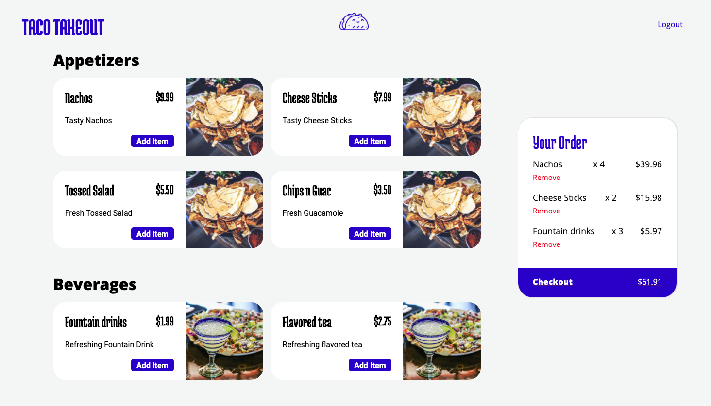
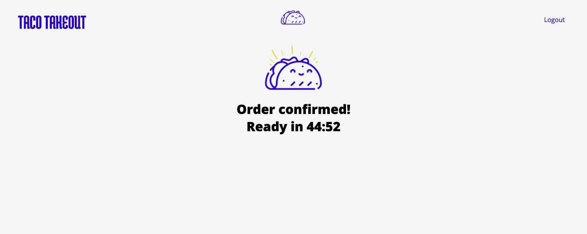

 Taco Takeout - Online ordering for Pickup
=========

A food ordering experience for a single restaurant (Taco Takeout). Customers can visit this website, select one or more dishes and place an order for pick-up. They will receive a text notification when their order is ready.

When an order is placed the restaurant receives the order via SMS. The restaurant can then specify how long it will take to fulfill it via the admin screen. Once they provide this information, the website updates for the client and also notifies them via SMS.

This app uses the Twilio API service to implement SMS commuication from the website to the customer and restaurant. 

## Screenshots 
### Order screen
shows menu items and a cart that updates with every item add and remove

### Order confirmed page
updates with admin approval of order, shows live countdown

## Project Contributors and Primary Responsibilities

* MacKenzie Joyal
  * Front end design and development
  * Back end development
* Bryn Schulha
  * Twilio API research and implementation
  * Front end design and development 
* Eddy Bussiere 
  * Database design
  * Back end Development

## Built With

* Express and Node.js
* jQuery 
* EJS templating 
* SCSS

## Getting Started

1. Install dependencies: `npm i`
2. Fix to binaries for sass: `npm rebuild node-sass`
3. Reset database: `npm run db:reset`
  - Check the db folder to see what gets created and seeded in the SDB
4. Run the server: `npm run local`
  - Note: nodemon is used, so you should not have to restart your server
5. Visit `http://localhost:8080/`

## Dependencies

- Node 10.x or above
- NPM 5.x or above
- PG 6.x -->
