# Taco Takeout online ordering for pickup orders

## Project Contributors and primary responsibilities
* Mackenzie Joyal
  * Front end design & development
  * Login and checkout functionality
  * Back end development
  
* Bryn Schulha
  * Twillio API research and implementation
  * Front end design and development
 
* Eddy Bussiere
  * Database design and 
  * Back end development
  * Front end development

## What does it do?

This app allows a user to place an online order with Taco Takeout.

## User Stories
* As a user I want to visit a website so I can view a restaurant’s menu.
* As a user I want to see cart contents as I add items so I can review items and quantities.
* As a user I want to place an order from a viewed restaurant so I can pick it up.
* As a user I want to be notified by SMS that the restaurant has received my order and be given the time when my order is expected to be ready so I can plan to arrive on time.
* As a user I want to be notified by SMS that my order is ready so I can wait in the car if I arrive early

* As a restaurant owner I want to post my menu items on a website to increase pickup order sales.
* As a restaurant owner I want to receive notifications by SMS of incoming orders so preparation can begin.
* As a restaurant owner I want to notify customers by SMS of order receipt and provide an accurate estimate of pickup time so they can plan their route.
* As a restaurant owner I want to notify customers by SMS that their order is ready for pickup so they can wait in their vehicle if they arrive early.       

## Endpoints
* app.get('/api/users/', registered users);
* app.get('/api/orders/' existing orders)
* app.get('/api/menuitems/', available menuitems);
* app.get('/api/menucategories/', available menu categories);
(Add the rest from the app functions)

==== EXAMPLE DELETE WHEN COMPLETE ====
# Edge App

## Example stuff from SMPedge.

## Roles

- Marketing
- Project Manager
- Contactor
- CAD Guy

## Use Cases

1. Notification page (start page)
1. Staff
    - status page
    - profile information
        - Location
        - Title
1. Project list
1. Bidding

## Use Case Details

### Start Page

"Wire Items" - Headline at top & archive down right side used to communicate company info to staff.
"Feature Project" - Brag about how good we are as electrical engineers... internally waste of space and my time. Should have been an events calendar.

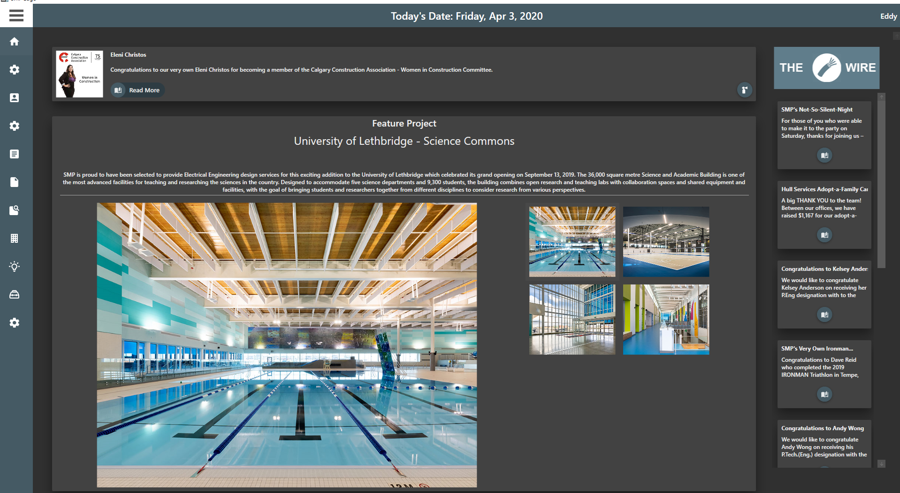

### Start Page Admin

"Content management" - Used by marketing department to edit Start page.

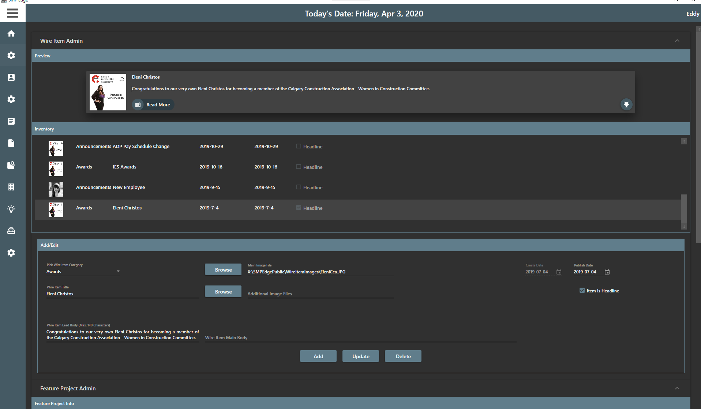
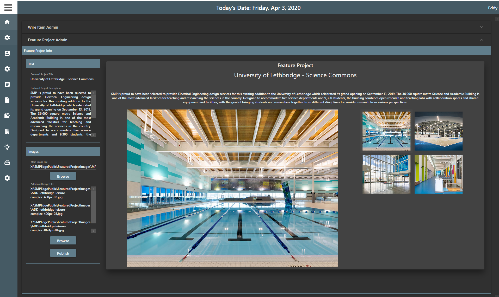

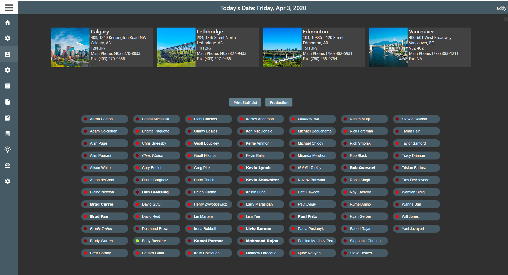

### Staff Member Chips

- Green - Employee is in office
- Dark red - Employee is out and has not indicated neither location nor return time.
- Bright red - Employee is out and has indicated location and/or return time.

  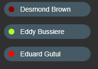

### Staff Member Dialog for Self

### Staff Member Dialog for Other

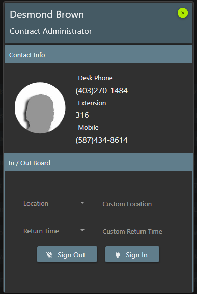

### Staff Member Admin

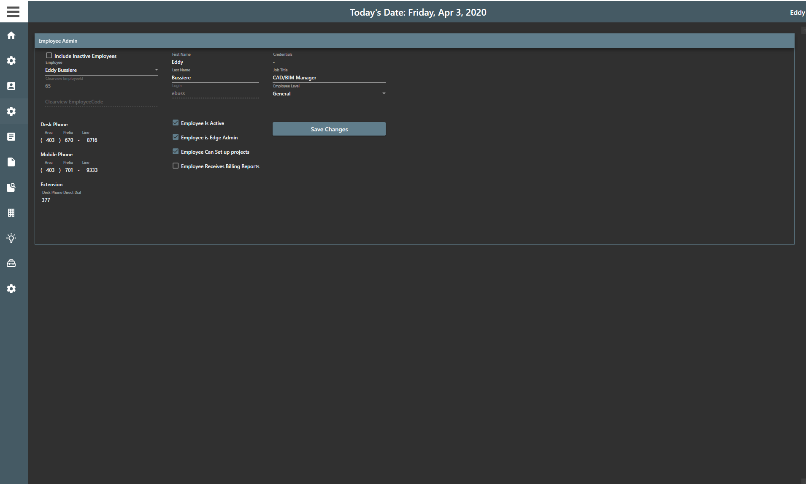

### Document Template Resource (concept)

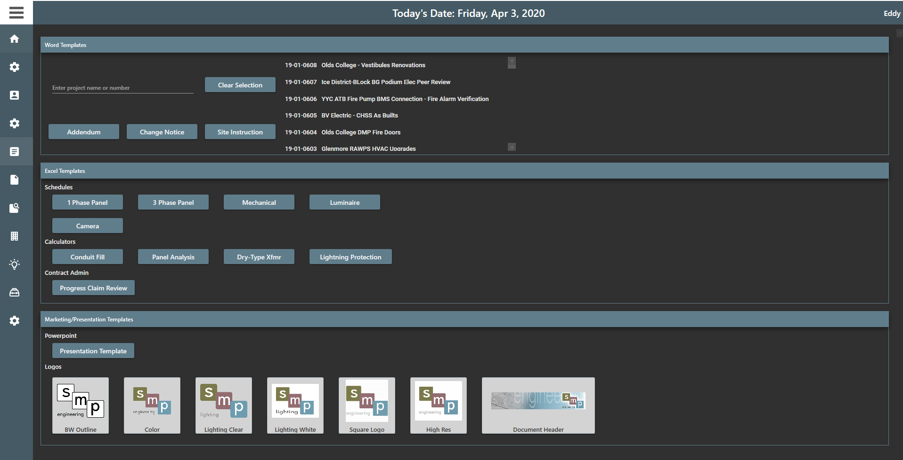

### Detail drawing Library

Also contained in:

- Edge for Revit Addin (creates new detail view converts Autocad entities to Revit elements)
- Edge for AutoCAD Addin (inserts detail into drawing)

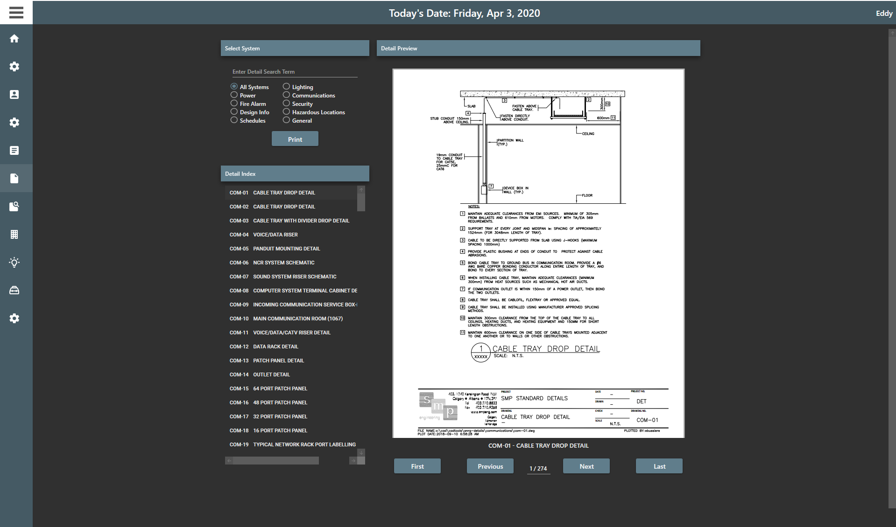

## Project Search by

- SearchString
- Project Office
- Manager in Charge
- Project Year
- Client
- Project market sector

Selected item in results pane shows:

- Project Manager
- Top 3 billing employees
- Manager who receives billing report
- "Go to Project" button opens windows explorer to project folder.

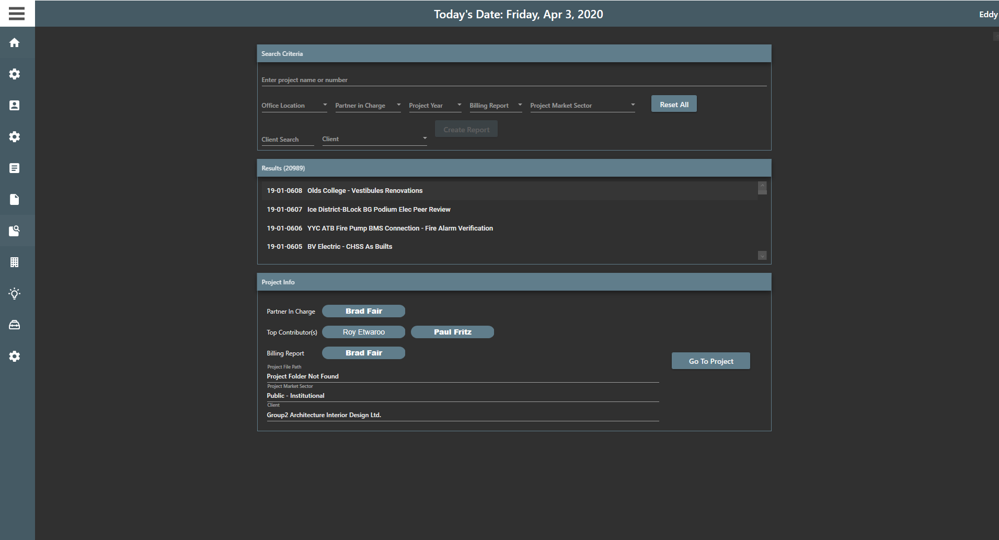

## Project Initiate

Completed form:

- Assigns project number
- Submits project details to accounting for entry.
- Creates project folder from template store.

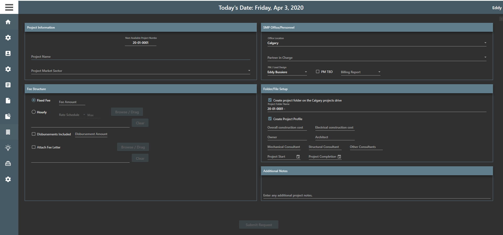
==== Examples ====
